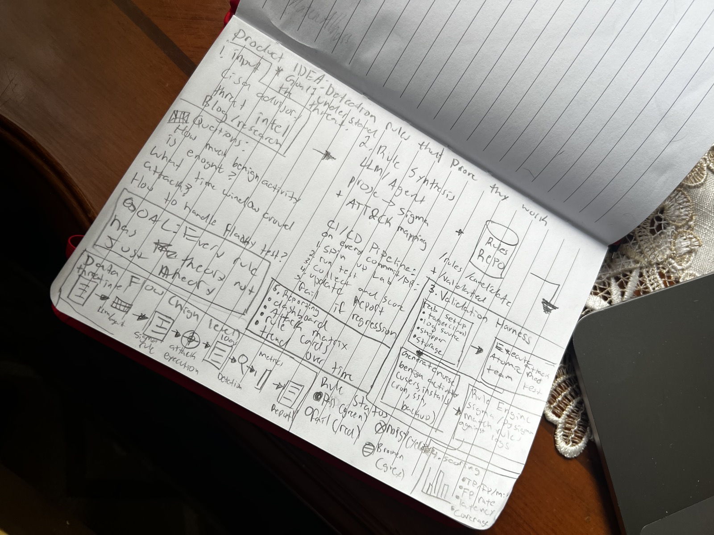
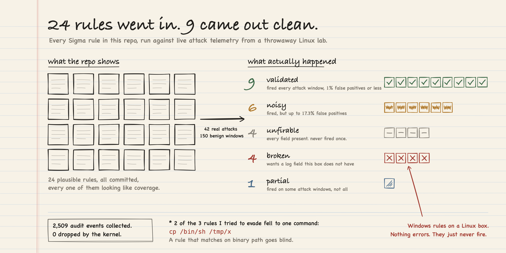

# blacklight

Detection rules that prove they actually fire. I wrote 24 Sigma rules, ran real attacks at them, and kept score. Nine of them work. The rest don't, and now I can tell you exactly why.



<details>
<summary><b>Click for the formal report</b></summary>

<br>

[](https://mazen-alhassan.github.io/blacklight/report.html)

**[Open the full interactive report →](https://mazen-alhassan.github.io/blacklight/report.html)**

The long version of what this run found is in [FINDINGS.md](FINDINGS.md).

</details>

## The problem

You can write a detection rule that looks completely fine, commit it, and never find out it doesn't fire. Nothing errors. Nothing warns you. It just sits in the repo looking like coverage you don't actually have.

So I built a lab that checks. Every rule runs against real kernel telemetry from attacks I actually executed in a throwaway Linux container, plus 150 windows of boring normal activity. Each rule comes out with a measured true positive count and a measured false positive rate instead of a guess.

Out of 24 rules: **9 are validated**, 6 fire but are way too noisy to ship, 1 only fires some of the time, and 4 are straight up broken because they need log fields this lab doesn't even have.

Fair warning on scope. The sensor is auditd on a single Linux box, so anything Windows specific isn't validated and I say so instead of pretending. The evasion testing is shallow too — just renamed binaries and simple encoding — and it already beat two of the rules that do fire.

Everything above comes from one run, saved as `data/results.json`. The kernel didn't drop a single event on it.

## Quick start

The report and the hero images regenerate from the saved results, and you don't need Docker for that part:

```
python3 -m venv .venv && . .venv/bin/activate
pip install pysigma pysigma-backend-sqlite pyyaml jinja2 pytest
make test                      # unit tests, no Docker
python -m scoring.rescore      # re-score the committed telemetry.db
make report                    # rebuild docs/report.html from results.json
```

A full run does need Docker, since it stands up a privileged auditd sensor container and a target:

```
make run BENIGN=150 REPS=2     # lab up, run atomics + benign, score, tear down
make report                    # coverage matrix and worst offenders
```

`make run` brings the lab up, runs every atomic and benign profile as a timed window, grabs the audit log, normalizes it into SQLite, scores every rule, then tears it all down. It also checks that the kernel didn't lose any events, and fails the run if it did.

## How it works

**The lab**
- Docker Compose runs two containers against one kernel.
- A privileged sensor container runs auditd with `pid=host`.
- A normal looking target container runs the attacks and the benign work.
- auditd is the only sensor. One vocabulary covers process execution, outbound connections, ptrace, kernel module loads, and file watches.
- Sticking to one sensor keeps the field-availability analysis honest. If I'd split it across two agents I couldn't tell you which one was missing what.

**Timing the windows without a clock**
- The executor never reads a clock to time a window.
- Instead it runs a uniquely named sentinel before and after each activity (`/bin/true __LWSTART_<uuid>__`).
- The sensor logs those sentinels like any other exec.
- The normalizer uses the sentinel timestamps to work out where each window starts and ends.
- Then it figures out which events belong to that window by walking the process tree from the shell the executor spawned.
- This gets rid of clock skew between the orchestrator, the target, and the sensor.
- It also keeps lab activity separate from all the Docker noise the sensor picks up anyway.

**The engine**
- `engine/pipeline.py` maps Sigma field names onto the real telemetry columns.
- That map is the one place describing what the lab actually carries.
- If a rule names a field that isn't in the map, it's marked `broken` before any query runs, and the report tells you which field is missing.
- Everything else gets compiled to SQL by pySigma and run against the events table.

**The score** — every rule lands in exactly one bucket:
- `validated` — fires on every attack window for its technique, and false positives stay at or under 1%
- `noisy` — fires on the attack, but throws way too many false positives
- `partial` — fires on some attack windows but not all of them
- `unfirable` — every field it needs is there, it just never fired
- `broken` — needs a field the lab doesn't have
- `untested` — no atomic test exercises it

I locked this taxonomy into `docs/SPEC.md` before I'd seen a single number, so I couldn't move the goalposts once results started coming in.

**Where to read more**
- `docs/SPEC.md` — the spec and the locked data schema
- `docs/ARCHITECTURE.md` — module boundaries and why things are split the way they are
- `FINDINGS.md` — what this run actually found, in full

## Known limitations

Putting these up front because they're the first thing anyone asks about.

- **Single host.** No lateral movement, no network sensor, no east-west traffic. If it needs two machines, it's out of scope here.
- **No Windows telemetry.** Those 4 broken rules are Sigma rules written against Sysmon and Windows Event Log fields (`GrantedAccess`, `Hashes`, `IntegrityLevel`, `EventID`, `TargetObject`). I left them in on purpose, because catching them is the whole point.
- **File-open telemetry is namespace-bound.** auditd `-w` path watches are tied to inodes and namespaces, so the sensor in its own container can't see file opens inside the target. That's why `shadow_file_read` comes back `unfirable`. It's a real gap, not a bug.
- **The benign corpus is synthetic.** I wrote it, and I wrote the rules too, so it's biased toward the noise I thought to create. The 0% median false positive rate on the clean rules points the right way, but it isn't what you'd get against the millions of events a real SIEM sees.
- **Evasion testing is shallow.** Renamed binaries and simple encoding, that's it. It still beat two of the firing rules (see `FINDINGS.md`), which says more about how much room is left than about how good the rules are.
- **Atomic Red Team tests are known-signature attacks.** Real attackers don't work off the same script.

## Layout

```
lab/        docker compose, sensor + target images, audit.rules
harness/    executor, sensor lifecycle, auditd parser, normalizer, noise
engine/     Sigma field mapping and SQL compilation
scoring/    windows + matches -> results.json, plus a Docker-free rescore
rules/      candidate Sigma, and the synthesizer that writes them from intel
report/     results.json -> report.html and the hero images
data/       results.json and the telemetry it came from
docs/       SPEC, ARCHITECTURE, report.html, hero images
```
