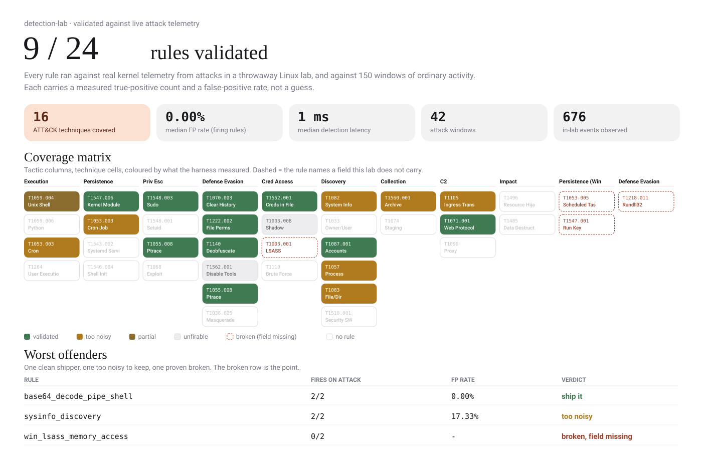

# blacklight

*Detection rules that prove they fire. Every Sigma rule in this repo is validated against live attack telemetry, so the ones that silently never fire get flagged instead of sitting in the repo looking like coverage.*



Detection rules that get tested like code. Every rule in this repo runs against real kernel telemetry generated by executing attacks in a throwaway Linux lab, and against 150 windows of ordinary benign activity, so each one carries a measured true positive count and a false positive rate instead of a guess. Of 24 candidate rules, 9 are validated, 6 fire but are too noisy to ship, one is partial, and 4 are marked broken because the log fields they depend on do not exist in this lab. The sensor is auditd on a single Linux host, so anything Windows specific is unvalidated and reported as such. Evasion testing is shallow, currently renamed binaries and simple encoding, and it already slips two of the firing rules.

The numbers above and everything below come from one run, committed as `data/results.json`. The lab dropped zero audit events on that run.

## Quick start

The report and the hero regenerate from the committed results without Docker:

```
python3 -m venv .venv && . .venv/bin/activate
pip install pysigma pysigma-backend-sqlite pyyaml jinja2 pytest
make test                      # unit tests, no Docker
python -m scoring.rescore      # re-score the committed telemetry.db
make report                    # rebuild docs/report.html from results.json
```

A full run needs Docker (a privileged auditd sensor container and a target):

```
make run BENIGN=150 REPS=2     # lab up, execute atomics + benign, score, teardown
make report                    # coverage matrix and worst offenders
```

`make run` stands up the lab, executes every atomic and benign profile as a timed window, collects the audit log, normalizes it into SQLite, scores every rule, and tears the lab down. It asserts the kernel lost zero events and fails the run if it did not.

## How it works

**The lab**
- Docker Compose runs two containers against one kernel.
- A privileged sensor runs auditd with `pid=host`.
- A normal-looking target runs the attacks and the benign work.
- auditd is the only sensor. One vocabulary covers process execution, outbound connect, ptrace, kernel module load, and file watches.
- One sensor keeps the field-availability analysis honest instead of split across two agents.

**Windows without a clock**
- The executor never times a window by reading a clock.
- It runs a uniquely named sentinel before and after each activity (`/bin/true __LWSTART_<uuid>__`).
- The sensor records those sentinels like any other exec.
- The normalizer bounds the window from the sentinel timestamps.
- It attributes events by walking the process tree from the shell the executor spawned.
- That removes clock skew between the orchestrator, the target, and the sensor.
- It also separates lab activity from the Docker machinery the sensor also sees.

**The engine**
- `engine/pipeline.py` maps Sigma field names onto the telemetry columns.
- That map is the single description of what the lab actually carries.
- A rule naming a field not in the map is `broken` before any query runs, and the report names the missing field.
- pySigma compiles everything else to SQL over the events table.

**The score** — every rule lands in exactly one bucket:
- `validated` — fires on every attack window for its technique, false positive rate at or under 1%
- `noisy` — fires on the attack, but too many false positives
- `partial` — fires on some attack windows, not all
- `unfirable` — every field is present, but it never fired
- `broken` — references a field the lab does not carry
- `untested` — no atomic exercises it

The taxonomy is fixed in `docs/SPEC.md` before any numbers were seen.

**Where to read more**
- `docs/SPEC.md` — the spec and the locked data schema
- `docs/ARCHITECTURE.md` — module boundaries and the design arguments
- `FINDINGS.md` — what this run actually found, in full

## Known limitations

Written down because this is the part that gets asked about.

- **Single host.** No lateral movement, no network sensor, no east-west traffic. Anything needing two hosts is out of scope.
- **No Windows telemetry.** The 4 broken rules are Sigma rules written against Sysmon and Windows Event Log fields (`GrantedAccess`, `Hashes`, `IntegrityLevel`, `EventID`, `TargetObject`). They are kept in the repo on purpose, because catching them is the point.
- **File-open telemetry is namespace-bound.** auditd `-w` path watches are inode and namespace scoped, so the containerized sensor does not see file opens inside the target. The `shadow_file_read` rule is `unfirable` for exactly this reason, and it is a real gap, not a bug.
- **The benign corpus is synthetic.** It was written by the same person who wrote the rules, so it is biased toward the noise that person thought to create. A 0% median false positive rate on the clean rules is directional, not a production estimate over the millions of events a real SIEM sees.
- **Evasion testing is shallow.** Renamed binaries and simple encoding only. It already evades two firing rules (see `FINDINGS.md`), which says more about how much room is left than about how strong the rules are.
- **Atomic Red Team tests are known-signature attacks.** Real adversary tradecraft differs.

## Layout

```
lab/        docker compose, sensor + target images, audit.rules
harness/    executor, sensor lifecycle, auditd parser, normalizer, noise
engine/     Sigma field mapping and SQL compilation
scoring/    windows + matches -> results.json, plus a Docker-free rescore
rules/      candidate Sigma, and the synthesizer that writes them from intel
report/     results.json -> report.html and the hero
data/       results.json and the telemetry it came from
docs/       SPEC, ARCHITECTURE, report.html, hero
```
